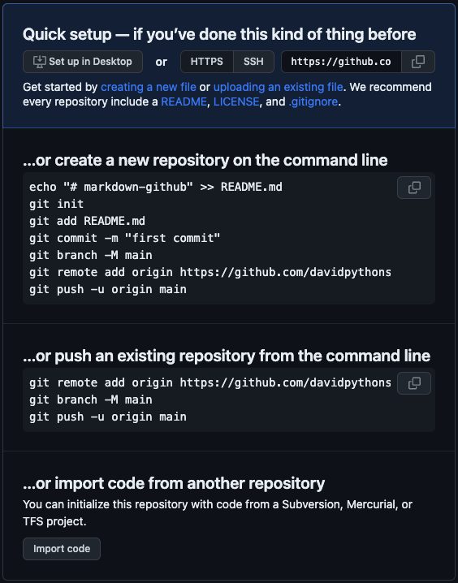

# MarkDown and github tutorial

## 英语单词

- markdown
  - `mar` `k` `down`
  - `妈` `可` `蛋`
- github
  - `git` `hub`
  - `吉` `哈`
- tutorial 
  - `tu` `to` `ri` `al`
  - `图` `脱` `累` `欧`
- 
## 基础问题

  - 什么是 `git`
  - 什么是 `github`
  - `tutorial` **解锁🔓技能**
  - `vscode` 链接 `github`

## Markdown常用语法

- 标题
  - `# 一级标题`
  - `## 二级标题`
  - `### 三级标题`

- 文本标记
  - `**加粗**`
  - **加粗**
  - `*斜体*`
  - *斜体*
  - `~~删除~~`
  - ~~删除线:处理完成任务~~

- 列表
  - 有序
    1. `1. xxx`
    2. `2. xxx`
    3. `3. xxx`

  - 无序
    - `* xxx`
    - `- xxx`
    - `+ xxx`

- 链接
  - [GitHub](https://github.com "程序员大本营")
  - `[GitHub](https://github.com "程序员大本营")`

- 图片 + 链接
    ```markdown
    [](图片链接 "鼠标提留提示语")
    ```

- 表格样式
    ```
    |左对齐|居中|右对齐|
    |-|:-:|-:|
    |-|-|-|
    ```
    |左对齐|居中|右对齐|
    |-|:-:|-:|
    ----|----|----|

- 表情包
    📦 Installation
    🔨 Getting Started
    👬 Community
    💃 Elegant API
    💪 HTML Entry Access Mode
    🛡 Style Isolation
    🧳 JS Sandbox
    ⚡  Prefetch Assets
    🔌 Umi Plugin Integration

## Git基本命令

- 新建工作站 `mkdir my_workstation`
- 进入工作站目录 `cd my_workstation`
- `Vscode`打开工作站 `code .`
- 打开网页新建项目 [git repository](https://github.com/new)
- 项目起名 `markdown-github`
- 克隆项目 `git clone https://github.com/davidpythonseo/markdown-github.git`
- 初始化 `git init`
- 添加索引 `git add .`
- 合并源码 `git commit -m "提交说明"`
- 创建主分支 `git branch -m main`
- `SSH`链接项目 `git remote add origin git@github.com:davidpythonseo/markdown-github.git`
- 查看要看 `git remote -v`
- 修改`SSH`推送 `git remote set-url origin git@github.com:davidpythonseo/markdown-github.git`
- 推送项目到`main`分支`git push -u origin main`



## 进阶使用

- 帮助文档 `git --help`
- 翻译插件[Translator Helper](https://marketplace.visualstudio.com/items?itemName=XiaodiYan.translator-helper)

      
  ```bash
  usage: git [-v | --version] [-h | --help] [-C <path>] [-c <name>=<value>]
            [--exec-path[=<path>]] [--html-path] [--man-path] [--info-path]
            [-p | --paginate | -P | --no-pager] [--no-replace-objects] [--bare]
            [--git-dir=<path>] [--work-tree=<path>] [--namespace=<name>]
            [--super-prefix=<path>] [--config-env=<name>=<envvar>]
            <command> [<args>]

  These are common Git commands used in various situations:

  start a working area (see also: git help tutorial)
    clone     Clone a repository into a new directory
    init      Create an empty Git repository or reinitialize an existing one

  work on the current change (see also: git help everyday)
    add       Add file contents to the index
    mv        Move or rename a file, a directory, or a symlink
    restore   Restore working tree files
    rm        Remove files from the working tree and from the index

  examine the history and state (see also: git help revisions)
    bisect    Use binary search to find the commit that introduced a bug
    diff      Show changes between commits, commit and working tree, etc
    grep      Print lines matching a pattern
    log       Show commit logs
    show      Show various types of objects
    status    Show the working tree status

  grow, mark and tweak your common history
    branch    List, create, or delete branches
    commit    Record changes to the repository
    merge     Join two or more development histories together
    rebase    Reapply commits on top of another base tip
    reset     Reset current HEAD to the specified state
    switch    Switch branches
    tag       Create, list, delete or verify a tag object signed with GPG

  collaborate (see also: git help workflows)
    fetch     Download objects and refs from another repository
    pull      Fetch from and integrate with another repository or a local branch
    push      Update remote refs along with associated objects

  'git help -a' and 'git help -g' list available subcommands and some
  concept guides. See 'git help <command>' or 'git help <concept>'
  to read about a specific subcommand or concept.
  See 'git help git' for an overview of the system.
  ```